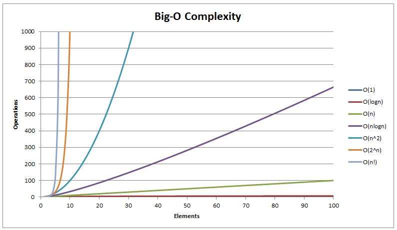
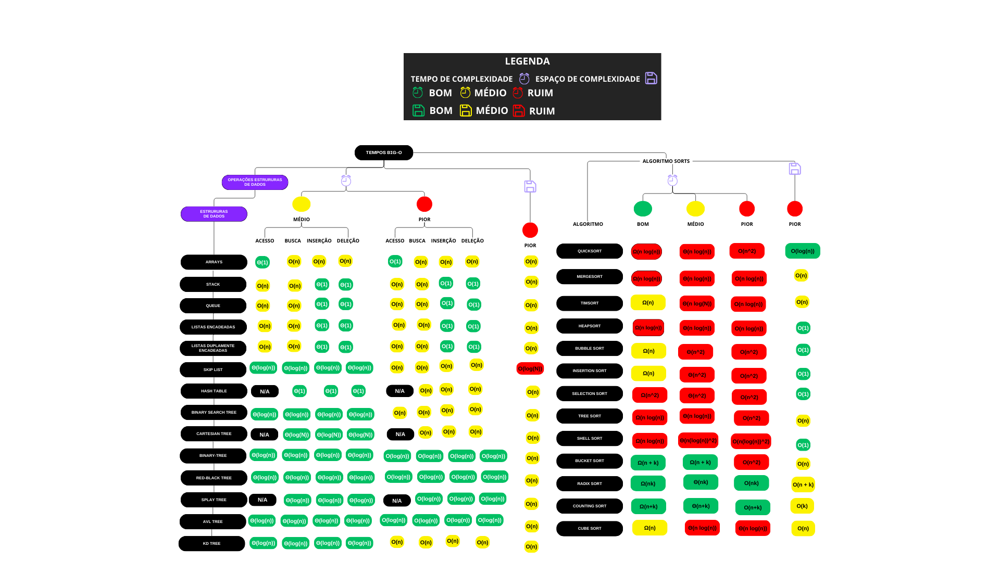

# Explicando Algoritmos, Paradigmas e Notações

## 📌🧩 Algoritmos

Algoritmos são conjuntos finitos de instruções ou regras bem definidas que descrevem, de forma
clara seguindo a abordagem top-down(de cima para baixo), uma sequência de passos para resolver
um problema ou realizar uma tarefa.
Na programação representam toda a base da escrita de um código ou software permitindo  
automatizar tarefas, resolver problemas computacionais como:

1. Tomar decisões (condições: if, else, etc.);
2. Repetir tarefas (laços: for, while);
3. Criar exceções ou tratar erros (uso de try, except ou throw, catch, dependendo da linguagem);
4. Organizar e manipular dados (sorts, adicionar, remover, redimensionar, buscar, etc).

---

## 🧠📚 Paradigmas de Programação

Paradigmas de programação são modelos ou estilos de desenvolvimento que orientam a forma  
como os programas são estruturados e escritos. Cada paradigma possui uma forma distinta de  
pensar e organizar a lógica do software.

---

🔹 **Principais paradigmas:**

**Paradigma Imperativo**  
O programador descreve passo a passo o que o computador deve fazer.  
🔸 Ex.: C, Python (modo imperativo), Java  
🛠 Usa comandos, variáveis e estruturas de controle (if, for, while).

---

**Paradigma Declarativo**  
Foca em _o que deve ser feito_, e não como fazer.  
🔸 Ex.: SQL, HTML, Prolog  
🛠 O programador descreve os resultados desejados, e o sistema decide como alcançá-los.

---

**Paradigma Funcional**  
Baseado em funções matemáticas puras, sem efeitos colaterais.  
🔸 Ex.: Haskell, Lisp, Elixir, partes de Python e JavaScript  
🛠 Usa funções como unidades básicas, evitando o uso de variáveis mutáveis.

---

**Paradigma Orientado a Objetos (POO)**  
Organiza o código em "objetos", que combinam dados (atributos) e comportamentos (métodos).  
🔸 Ex.: Java, C++, Python, Ruby  
🛠 Promove reutilização de código, encapsulamento, herança e polimorfismo.

---

**Paradigma Lógico**  
Baseado em lógica formal e regras. O programa é uma coleção de fatos e regras, e a execução consiste em realizar inferências.  
🔸 Ex.: Prolog  
🛠 Muito usado em sistemas de IA simbólica.

---

**Paradigma Orientado a Eventos**  
No paradigma orientado a eventos, a execução do programa é direcionada por eventos,
como cliques de mouse, pressionamento de teclas, mensagens do sistema ou sensores.
É muito utilizado em interfaces gráficas (GUIs), aplicações web e sistemas interativos.  
🔸 Ex.: de linguagens/frameworks: JavaScript (navegador), C# com WinForms/WPF,
Java com Swing/JavaFX, Python com Tkinter/PyQt, C++ com wxWidgets e outros.  
🛠 Muito usado em desenvolvimento de interfaces gráficas, jogos e sistemas reativos.

---

## 📏📊 Notações Assintóticas

Apesar da diversidade de algoritmos e paradigmas, é essencial entender como medir o desempenho de um algoritmo.
Para isso, usamos as **notações assintóticas**, que descrevem o comportamento do tempo de execução (ou uso de memória)
à medida que a entrada — muitas vezes representada por `n` — cresce.

🔹 **Principais notações:**

- `O(1)` – Tempo constante: a operação leva sempre o mesmo tempo, independente da entrada.
- `O(log n)` – Tempo logarítmico: cresce devagar à medida que a entrada aumenta (eficiente).
- `O(n)` – Crescimento linear: o tempo cresce proporcionalmente ao tamanho da entrada.
- `O(n log n)` – Eficiência intermediária (ex: mergesort, heapsort).
- `O(n²)` – Tempo quadrático: cresce muito com entradas grandes (ex: algoritmos de ordenação ineficientes).
- `O(2^n)` – Tempo exponencial: extremamente ineficiente para entradas grandes.
- `O(n!)` – Fatorial: cresce de forma explosiva, comum em problemas de força bruta.
- `Ω` (Ômega) – Limite inferior (melhor caso).
- `Θ` (Teta) – Crescimento exato (caso médio).

Essas notações ajudam a comparar algoritmos e escolher a melhor solução para diferentes cenários e tamanhos de entrada.

A complexidade de um algoritmo é uma medida que nos ajuda a entender o desempenho em termos de tempo de execução
(tempo de complexidade) e uso de memória (espaço de complexidade).
Esses conceitos são fundamentais para comparar algoritmos e escolher a melhor solução para  
um problema, e entenda que seja o que estiver fazendo (algoritmo, backend, banco de dados,
interface gráfica, entender e aplicar estes conceitos de bigO é essencial).

---

### Tempo de Complexidade (Time Complexity)

Representa quanto tempo um algoritmo leva para executar em relação ao tamanho da entrada (`n`).
É geralmente expresso usando a notação Big-O (`O`).

---

### Espaço de Complexidade (Space Complexity)

Representa quanta memória um algoritmo consome em relação ao tamanho da entrada (`n`).
Também é expresso em notação Big-O. Ex: `O(1)` (memória fixa) ou `O(n²)` (matriz `n × n`).

---

## Estimando tempo de execução

Para estimar o tempo de execução assintótico de um algoritmo (ou seja, em termos de complexidade de tempo),
focamos principalmente nos seguintes elementos:

---

### 🔁 1. Loops (Simples ou Aninhados)

São geralmente os maiores influenciadores de tempo.

Exemplo:

- Um loop simples: `O(n)`
- Dois loops aninhados: `O(n²)`
- Três loops aninhados: `O(n³)`,

---

### 🔁📞 2. Chamadas de Funções (Recursivas ou Não)

Recursão merece atenção especial:

Exemplo:

- Divisão por dois: `T(n) = T(n/2) + O(1) → O(log n)`
- Duplicação de chamadas: `T(n) = 2T(n-1) + O(1) → O(2ⁿ)`

---

### ⚙️ 3. Operações Internas

Operações aparentemente simples como +, \*, acesso a vetor etc., são O(1).
Porém, se estiverem dentro de loops ou recursões, contribuem para o tempo total.

- Exemplo: Uma soma dentro de um loop de `n` → `O(n)`

---

### 🧱 4. Estruturas de Dados e Seus Acessos

Cada estrutura tem uma complexidade típica:

- Listas (Python): Acesso por índice: `O(1)`, Busca com in: `O(n)`
- Dicionários / Hash Maps: `O(1)` em média, `O(n)` no pior caso
- Árvores balanceadas: `O(log n)`
- Filas, Pilhas: `O(1)` inserção/remoção em geral

---

### 🔀 5. Condições de Fluxo (if/else)

- Não alteram diretamente a complexidade, mas podem:

  - Mudar o caminho de execução;
  - Criar diferentes cenários (melhor, médio ou pior caso);
  - Controlar repetições.

- **Observação:** tente diminuir a quantidade de `if/else` quando:
  - Há múltiplos casos baseados em um mesmo valor → usar `switch`;
  - As decisões podem ser representadas em **tabelas ou arrays de funções**;
  - É possível aplicar **polimorfismo** ou abstração para substituir condições complexas;
  - Utilize **expressões lógicas** (`!`, `||`, `&&`) para combinar condições e reduzir blocos `if`;
  - Prefira **operador ternário (`? :`)** para atribuições simples com duas opções, mantendo o código mais enxuto.

---

### 🧩 6. Uso de Funções Prontas / Bibliotecas

Muitas linguagens oferecem métodos com complexidade já definida:

- `.sort()` (em Python, C++, Java): geralmente `O(n log n)`
- `.find()` em strings ou vetores: `O(n)`
- `.set()` ou dict() em Python: `O(1)` inserção/busca (em média)

---

### 📊 Gráfico de Complexidade Big-O

---

## 📚 Livros para entender algoritmos

Aqui estão alguns livros fundamentais (e acessíveis) para entender algoritmos, desde a base teórica até a aplicação prática:

### 🟩 Iniciantes

🔹 **"Algoritmos: Lógica para Desenvolvimento de Programação de Computadores" — Edécio Fernando Iepsen**  
📘 Aborda lógica de programação e introduz os conceitos de algoritmos com exemplos simples.

🔹 **"Introdução à Programação com Algoritmos e Estruturas de Dados" — Adilson Marques da Cunha**  
📘 Excelente para quem está começando e deseja compreender algoritmos com foco em
resolução de problemas.

---

### 🟨 Intermediários

🔹 **"Entendendo Algoritmos" — Aditya Y. Bhargava**  
📘 Uma introdução visual e intuitiva a algoritmos clássicos, ideal para quem está aprendendo sozinho.  
🧠 Diagramas e ilustrações facilitam a compreensão.

🔹 **"Estruturas de Dados e Algoritmos em C" — Mark Allen Weiss**  
📘 Aborda algoritmos com foco em implementação prática usando C, útil para estudantes da
área de exatas e TI.

---

### 🟥 Avançados

🔹 **"Algoritmos: Teoria e Prática" — Thomas H. Cormen, Charles E. Leiserson, Ronald L. Rivest, Clifford Stein (CLRS)**  
📘 Abrange desde os fundamentos até tópicos avançados com rigor matemático.  
📊 Ideal para cursos de graduação, concursos e entrevistas técnicas.

🔹 **"The Art of Computer Programming" — Donald E. Knuth**  
📘 Série clássica e extremamente detalhada. Recomendado para quem deseja uma compreensão
profunda e formal da área.

---

### 📌 Dica extra

🔍 Estes livros têm versões digitais, resumos ou capítulos disponíveis online.  
🧑‍💻 Também é possível complementar com vídeos no YouTube, como os dos canais
**Curso em Vídeo**, **Geek University**, **MIT OpenCourseWare** e **Lira's Coding**.
