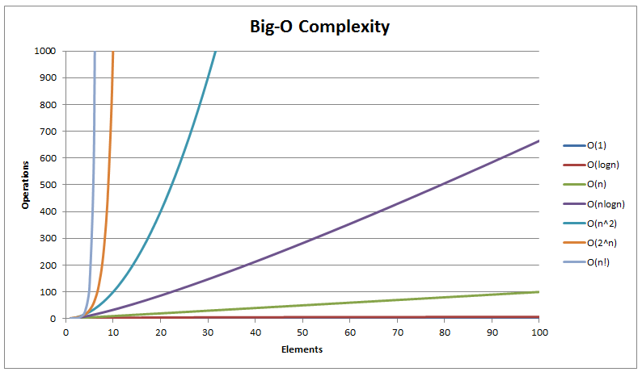
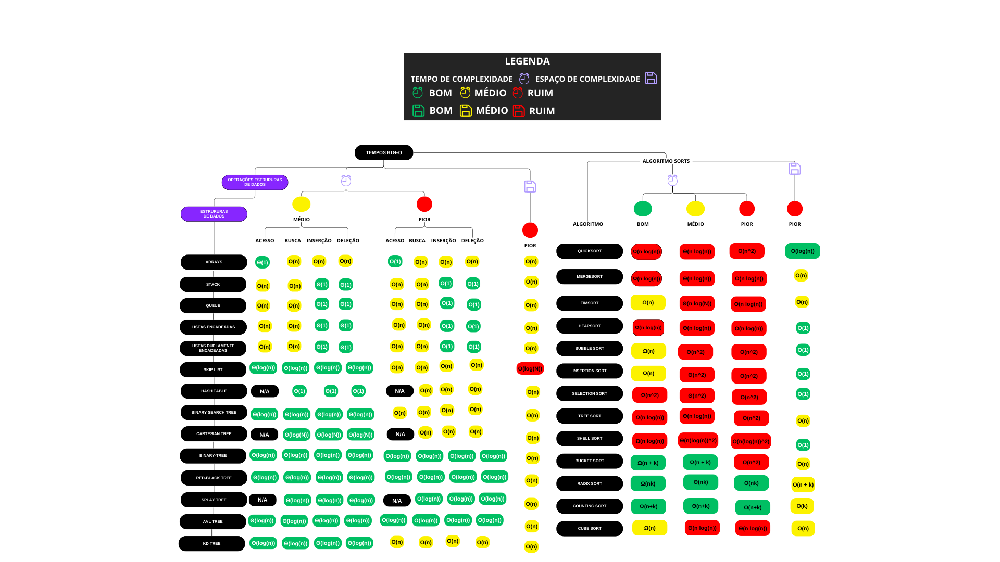

<!-- @format -->

# Notações e Complexidades

## 1. O Que é Complexidade?

Seja do código mais **complexo** até o mais **simples**, há um custo computacional **independente da máquina**, onde todo **algoritmo** irá consumir
**tempo** e **espaço** (memória) para ser executado.

A complexidade é a medida de como esses recursos crescem à medida que o tamanho da entrada,
conhecida na computação como (`n`), aumenta. Vale destacar que diferentes máquinas executam o mesmo código em tempos diferentes.

Para comparar algoritmos de forma justa, usamos a **análise assintótica** — medimos como o algoritmo **se comporta** quando `n`
tende ao infinito, ignorando constantes e detalhes de hardware.

---

## 2. Notação Assintótica e Base Matemática

Sabendo então que as **notações assintóticas** são a base para medir e definir o desempenho de um algoritmo,
vejamos como essa base é definida matematicamente.

### Definição Matemática Formal

Dizemos que **f(n) = O(g(n))** se existem constantes positivas **c** e **n₀** tais que: **0 ≤ f(n) ≤ c × g(n), para todo n ≥ n₀**

> Resumindo: a partir de um certo ponto (n₀), o crescimento do algoritmo não ultrapassa `c` vezes o crescimento de `g(n)`.

### Exemplo Numérico

Seja:

> f(n) = 3n² + 5n + 2.

Podemos dizer que **f(n) = O(n²)**

> porque: **3n² + 5n + 2 ≤ 4n² para todo n ≥ 6 (c = 4, n₀ = 6)**

Onde:

- `c = 4`
- `n₀ = 6`

---

## 3. Principais Notações Assintóticas

### Big-O (O)

Representa o **limite superior** da complexidade. Ou seja, o algoritmo **não será pior que isso**.

- Exemplo: Se um algoritmo é `O(n²)`, ele pode ser `O(n)`, `O(n log n)` ou `O(n²)`, mas nunca crescer mais rápido que `n²`.
- Uso prático: **Pior caso**

---

### Big-Omega (Ω)

Representa o **limite inferior** da complexidade. Ou seja, o algoritmo **não será melhor que isso**.

- Exemplo: Se um algoritmo é `Ω(n log n)`, ele nunca será melhor que `n log n`.
- Uso prático: **Melhor caso**

---

### Theta (Θ)

Representa um **limite apertado**. O crescimento do algoritmo é **exatamente dessa ordem**, tanto no limite superior quanto no inferior.

- Exemplo: Se um algoritmo é `Θ(n log n)`, ele cresce nessa ordem para entradas grandes.
- Uso prático: **Descrição exata do crescimento do algoritmo**

---



> Entendendo o Gráfico de Classes Comuns de Complexidade

| Complexidade | Nome         | Exemplo                        |
| ------------ | ------------ | ------------------------------ |
| O(1)         | Constante    | Acessar elemento de array      |
| O(log n)     | Logarítmica  | Busca binária                  |
| O(n)         | Linear       | Busca linear                   |
| O(n log n)   | Linearítmica | Merge Sort, Quick Sort (médio) |
| O(n²)        | Quadrática   | Bubble Sort, Selection Sort    |
| O(2ⁿ)        | Exponencial  | Fibonacci recursivo ingênuo    |
| O(n!)        | Fatorial     | Permutações, TSP força bruta   |

---

> Tempos BigO e complexidade de algoritmos



---

## 4. Tempo vs Espaço de Complexidade

### Tempo de Complexidade (Time Complexity)

Representa quanto tempo um algoritmo leva para executar em relação ao tamanho da entrada (`n`). É geralmente expresso usando a notação Big-O (`O`).

### Espaço de Complexidade (Space Complexity)

Representa quanta memória um algoritmo consome em relação ao tamanho da entrada (`n`).
Também é expresso em notação Big-O. Ex: `O(1)` (memória fixa) ou `O(n²)` (matriz `n × n`).

## 5. Estimando tempo de execução

Para estimar o tempo de execução assintótico de um algoritmo (ou seja, em termos de complexidade de tempo),
focamos principalmente nos seguintes elementos:

### 5.1. Loops (Simples ou Aninhados)

- Loop simples: `O(n)`
- Dois loops aninhados: `O(n²)`
- Três loops aninhados: `O(n³)`

```c
for (int i = 0; i < n; i++) {
    printf("%d\n", i);
}
// O(n)

for (int i = 0; i < n; i++) {
    for (int j = 0; j < n; j++) {
        printf("%d\n", i + j);
    }
}
// O(n²)
```

---

### 5.2. Chamadas de Funções (Recursivas ou Não)

Recursão merece atenção especial:

Exemplo:

- Divisão por dois: `T(n) = T(n/2) + O(1) → O(log n)`

```c
for (int i = n; i > 0; i /= 2) {      // log₂(n) vezes
    printf("%d\n", i);                // O(1)
}
// Complexidade: O(log n)
```

- Duplicação de chamadas: `T(n) = 2T(n-1) + O(1) → O(2ⁿ)`

```c
// Recursão exponencial
int fib(int n) {
    if (n <= 1) return n;
    return fib(n - 1) + fib(n - 2);
}
```

---

### 5.3. Operações Internas(n) = T(n-1) + O(1) → O(n)

- T(n) = 2T(n/2) + O(n) → O(n log n)
- T(n) = 2T(n-1) + O(1) → O(2ⁿ)

Operações aparentemente simples como +, \*, acesso a vetor etc., são O(1).
Porém, se estiverem dentro de loops ou recursões, contribuem para o tempo total.

- Exemplo: Uma soma dentro de um loop de `n` → `O(n)`

---

### 5.4. Estruturas de Dados e Seus Acessos

Cada estrutura tem uma complexidade típica:

- Listas (Python): Acesso por índice: `O(1)`, Busca com in: `O(n)`
- Dicionários / Hash Maps: `O(1)` em média, `O(n)` no pior caso
- Árvores balanceadas: `O(log n)`
- Filas, Pilhas: `O(1)` inserção/remoção em geral

---

### 5.5. Condições de Fluxo (if/else)

- Não alteram diretamente a complexidade, mas podem:
  - Mudar o caminho de execução;
  - Criar diferentes cenários (melhor, médio ou pior caso);
  - Controlar repetições.

- Boas práticas com if/else:
  - Use `switch` quando há múltiplos casos baseados em um mesmo valor;
  - Use tabelas ou arrays de funções para substituir condições complexas;
  - Use expressões lógicas (`!`, `||`, `&&`) para combinar condições;
  - Prefira operador ternário (`? :`) para atribuições simples com duas opções.

---

### 5.6. Uso de Funções Prontas / Bibliotecas

Muitas linguagens oferecem métodos com complexidade já definida:

- `.sort()` (em Python, C++, Java): geralmente `O(n log n)`
- `.find()` em strings ou vetores: `O(n)`
- `.set()` ou dict() em Python: `O(1)` inserção/busca (em média)

> Lembre-se: boas práticas vão muito além da formatação do código.
> Elas envolvem escolhas corretas de algoritmos, estruturas de dados e análise de complexidade.

## Conclusão

Compreender complexidade não é apenas memorizar notações, mas entender como e por que um algoritmo cresce da forma que cresce.
Esse conhecimento é essencial para escrever código eficiente, escalável e sustentável.
